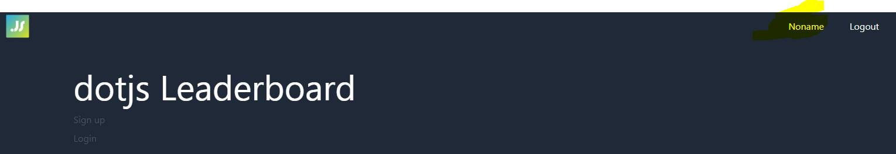

# Section 5 - Gentle intro to Blitz Console
Blitz comes with a sweet [console](https://blitzjs.com/docs/cli-console). The console can be really handy when working on you app. It gives you the ability to interact with the database and run some parts of your application in a shell.

Here are some key commands you can run with the console. These are the same as we'll later use in code:
* `await db.user.findMany()` // Finds many records
* `await db.user.findFirst()`, ie `await db.user.findFirst({ where: {id: 1} })` // Finds one record
* `await db.user.deleteMany()` // Deletes all users
* `await db.user.delete()`, ie `await db.user.delete({ where: {id: 1} })`
* `await db.user.create()`, ie `await db.user.create({ data: {email: "someemail@gmail.com", password: "asdasdsa", name: "Test"} })`
* `await db.user.update()`, ie `await db.user.update({ where: {id: 1}, data: {name: "new name"} })`

## Start the console
1) Run command `blitz console`. You should see this when the console is ready: 

> The blitz console supports top-level `await`. So you can `await new Promise((res) => res(console.log("worked")))` without wrapping it in async function 🔥
2) Run command `await db.user.findMany()`. You should see a list of all the users in the database.

## Fixing a problem
Right now, our application has a problem. When creating a user through the UI and logging in, there is no name to display: 

We don't have a field for adding the users name. We will fix that later, but for now - let's fix this using the Blitz console. 

1) Start `blitz console`
2) Find the id of the user you created by running `await db.user.findFirst({ where: {email: "<YOUREMAIL>"}})`
3) Grab the id if your user, and run `await db.user.update({where: {id: <YOUID>}, data: {name: "<YOURNAME>"} })`
4) Go back to the application running on localhost, and see that the name appears in the header (might need to refresh)

[Nice! Move on to section 6](../six)