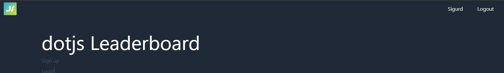

# Section 6 - Add user name when creating new user
1) Update the file `./app/auth/components/SignupForm.tsx` to add the `LabeledTextField` component for name and `name` in `initialValues`. Typescript will scream at us since `name` is not in the schema (we will fix that in step 2):
```tsx
import React from "react"
import { useMutation } from "blitz"
import { LabeledTextField } from "app/components/LabeledTextField"
import { Form, FORM_ERROR } from "app/components/Form"
import signup from "app/auth/mutations/signup"
import { SignupInput } from "app/auth/validations"

type SignupFormProps = {
	onSuccess?: () => void
}

export const SignupForm = (props: SignupFormProps) => {
	const [signupMutation] = useMutation(signup)

	return (
		<Form
			submitText="Create Account"
			schema={SignupInput}
			initialValues={{ email: "", password: "", name: "" }}
			onSubmit={async (values) => {
				try {
					await signupMutation(values)
					props.onSuccess?.()
				} catch (error) {
					if (error.code === "P2002" && error.meta?.target?.includes("email")) {
						// This error comes from Prisma
						return { email: "This email is already being used" }
					} else {
						return { [FORM_ERROR]: error.toString() }
					}
				}
			}}
		>
			<LabeledTextField name="name" label="Name" placeholder="Name" />
			<LabeledTextField name="email" label="Email" placeholder="Email" />
			<LabeledTextField name="password" label="Password" placeholder="Password" type="password" />
		</Form>
	)
}

export default SignupForm
```
2) Open the file `./app/auth/validations.ts`. This file contains the [`zod`](https://www.npmjs.com/package/zod) schema for our form. We use `zod` to create schemas to validate our data and infer the types in typescript. Let's add `name` in the `SignupInput`:
```ts
import * as z from "zod"

export const SignupInput = z.object({
  email: z.string().email(),
  password: z.string().min(10).max(100),
  name: z.string().min(2).max(100)
})
export type SignupInputType = z.infer<typeof SignupInput>

export const LoginInput = z.object({
  email: z.string().email(),
  password: z.string(),
})
export type LoginInputType = z.infer<typeof LoginInput>
```
Nice! Typescript should be happy with us again, please check that before proceeding.

3) We now have the form we need and a way to validate it, but the function that creates the database record does not receive the new data. Let's make that happen.
Open `./app/auth/mutations/signup.ts`. A mutation is an async function that receives arguments that you provide in addition to the Blitz context. The context contains the session of the user (among other things). Update the file to include `name`:
```ts
import { Ctx, SecurePassword } from "blitz"
import db from "db"
import { SignupInput, SignupInputType } from "app/auth/validations"

export default async function signup(input: SignupInputType, { session }: Ctx) {
  // This throws an error if input is invalid
  const { email, password, name } = SignupInput.parse(input)

  const hashedPassword = await SecurePassword.hash(password)
  const user = await db.user.create({
    data: { email: email.toLowerCase(), hashedPassword, role: "user", name },
    select: { id: true, name: true, email: true, role: true },
  })

  await session.create({ userId: user.id, roles: [user.role] })

  return user
}
```

4) Make sure the dev server is running, create a new user and feast you eyes on the header with the `name` field 🎉


Wow, what a blast! Now move on to [Section 7](../seven)
