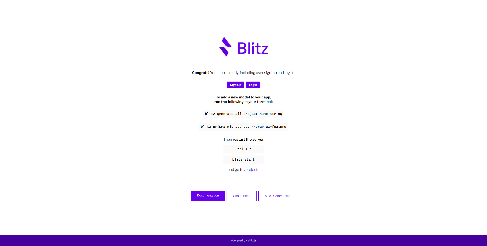

# Section 2 - Up and running with Blitzjs
## Installation
1) Install Blitz locally: `npm install -g blitz@0.29.7` (we'll use a pinned version of Blitz for this workshop)
2) Create new Blitz: `blitz new dotjs-leaderboard` (pick React Hook Form when asked about form choice)
3) Go to project and start server: `cd dotjs-leaderboard && blitz start`

## Verify installation
If you visit [http://localhost:3000/](http://localhost:3000/) and see this, you have successfully started Blitz:

**WIN** Already at this point, we have a working authentication and session management. Create a user and log in, you'll see 🏆

Congratz! Move on to [Section Three](../three)